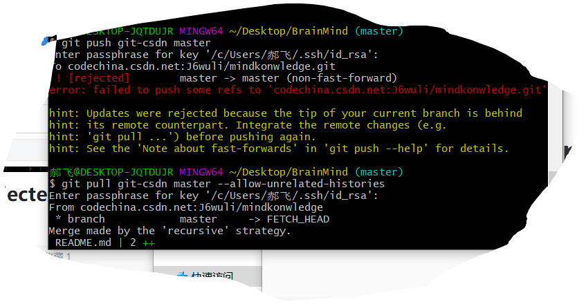

## ! [rejected]        master -> master (non-fast-forward)
**error: failed to push some refs to 'codechina.csdn.net:J6wuli/mindkonwledge.git'**
git在push代码到远程仓库的时候出现了这种情况：

网上的解释时，本地仓库没有与远程仓库同步，解决方案
git pull 远程库 远程分支 --allow-unrelated-histories
git add .
git commit -m 版本描述
git push 远程库 本地分支

